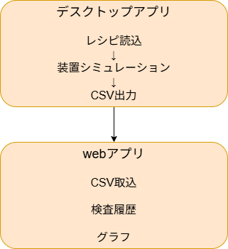
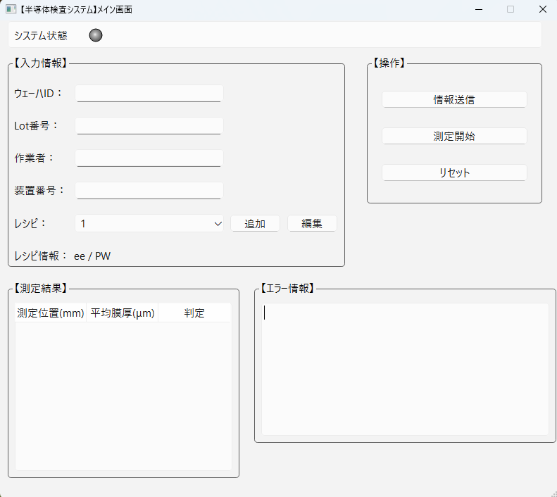
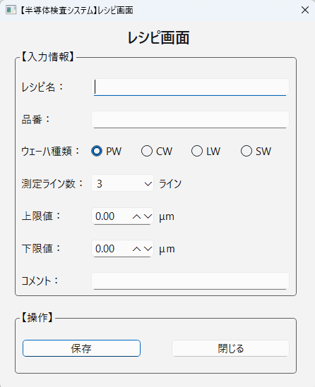
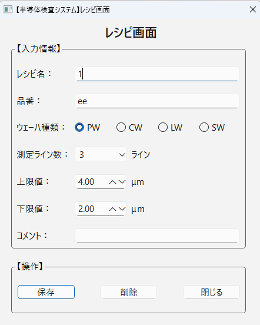

# SIS (Semiconductor Inspection System)

## 概要

半導体検査装置を想定したデスクトップアプリです。

レシピの作成・読込を行い、
測定シミュレーションを実施し、
CSV を出力します。

出力した CSV は Web アプリへ取り込み、
検査履歴や統計情報を表示します。

---

## 特徴

- デスクトップアプリと Web アプリを連携
- CSV を介した装置データ取り込みを再現
- ロット単位で検査履歴を管理
- グラフによる統計表示

---

## システム構成



---

## 画面スクリーンショット

### メイン画面



### レシピ画面(追加時)



### レシピ画面(編集時)



---

## 開発状況

### デスクトップアプリ

#### 画面

| 項目         | 実装状況    |
| ------------ | ----------- |
| メイン画面   | ✅ 実装済み |
| レシピ画面   | ✅ 実装済み |
| スタート画面 | ⬜ 未着手   |

#### 機能

| 項目                 | 概要                  | 設計状況    | 実装状況    |
| -------------------- | --------------------- | ----------- | ----------- |
| レシピ管理           | 作成・保存・読込      | ✅ 実装済み | ✅ 実装済み |
| 測定シミュレーション | 検査動作を模擬        | ✅ 実装済み | ✅ 実装済み |
| 測定結果表示         | 検査結果を Table 表示 | ✅ 実装済み | ✅ 実装済み |
| CSV 出力             | 検査結果を CSV 保存   | ✅ 実装済み | ✅ 実装済み |
| ログ閲覧             | 装置ログ表示          | ✅ 実装済み | ⌛ 実装中   |

### web アプリ

| 項目                 | 概要                  | 設計      | 実装      |
| -------------------- | --------------------- | --------- | --------- |
| ロットごとの測定結果 | --------------------- | ⬜ 未着手 | ⬜ 未着手 |
| 条件検索             | --------------------- | ⬜ 未着手 | ⬜ 未着手 |
| 権限管理             | --------------------- | ⬜ 未着手 | ⬜ 未着手 |
| 日ごとの膜厚推移     | --------------------- | ⬜ 未着手 | ⬜ 未着手 |
| OK 率                | --------------------- | ⬜ 未着手 | ⬜ 未着手 |
| 品種別 NG 件数       | --------------------- | ⬜ 未着手 | ⬜ 未着手 |

---

## 今後追加予定

- Qt 側の MVC アーキテクチャへのリファクタリング
- Qt Test による単体テスト追加
- CI/CD 環境構築
- Web アプリ連携
- CSV 入出力機能
- 検査履歴・統計表示

---

## 技術的な工夫

- Qt の Signal/Slot を利用し、画面イベントと処理を疎結合化

- Model と Repository を分離し、レシピデータ管理処理を独立化

- JSON ファイルを利用したレシピ保存・読込機能を実装

- QWidget を継承したカスタム Widget（StatusLamp）を作成

- CMake によるビルド構成管理

---

## 開発環境

### デスクトップアプリ

- Qt 6.8.3
- C++ 14
- CMake 3.30.5
- Visual Studio 2022

### Web アプリ

- FastAPI
- Python
- Uvicorn
- SQLAlchemy (予定)
- Javascript
- html/css

### Database

- SQLite

---

## 実行方法（利用者向け）

### デスクトップアプリ

1. GitHub Releases から最新版をダウンロードします。
2. ダウンロードした ZIP ファイルを展開します。
3. `SIS.exe` を実行します。

---

## 実行方法（開発者向け）

### デスクトップアプリ

#### 実行ファイルの生成

コマンドプロンプトを起動し、プロジェクトのルートディレクトリへ移動して、次のコマンドを実行します。

```bash
cmake -B build
cmake --build build --config Release
```

ビルド完了後、実行ファイルは次の場所に生成されます。

```text
build/Release/SIS.exe
```

#### Qt ランタイムの配置

Qt Command Prompt（または Qt の環境が設定されたコマンドプロンプト）を起動し、プロジェクトのルートディレクトリへ移動して、次のコマンドを実行します。

```bash
windeployqt build\Release\SIS.exe
```

これにより、実行に必要な Qt の DLL やプラグインが `build/Release` フォルダへ配置されます。

その後、次の実行ファイルを起動してください。

```text
build/Release/SIS.exe
```

---

## 設計資料

設計に関する詳細は、以下の資料を参照してください。

```text
|資料|リンク|
|---|---|
|システム概要|[System Overview](docs/system_overview.md)|
|画面設計|[Screen Design](docs/screen_design.md)|
|状態遷移図|[State Diagram](docs/state_diagram.md)|
|画面遷移図|[Screen Diagram](docs/screen_diagram.md)|
|測定データ設計|[Data Design](docs/data_design.md)|
|クラス概要|[Class Design](docs/class_design.md)|
|テスト仕様書|[Test Specification](docs/test_specification.md)|
```

---

## ディレクトリ構成

```text
SIS/
├─ src/
│  ├─ ui/              # 画面
│  ├─ widgets/         # カスタムWidget
│  ├─ model/           # データモデル
│  ├─ repository/      # データ保存処理
│  └─ Main.cpp
│
├─ docs/               # 設計資料
│
├─ CMakeLists.txt
└─ README.md
```

---
