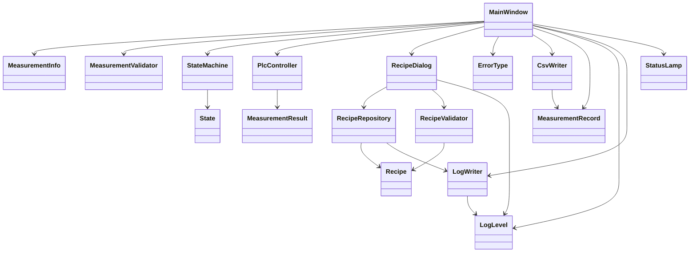
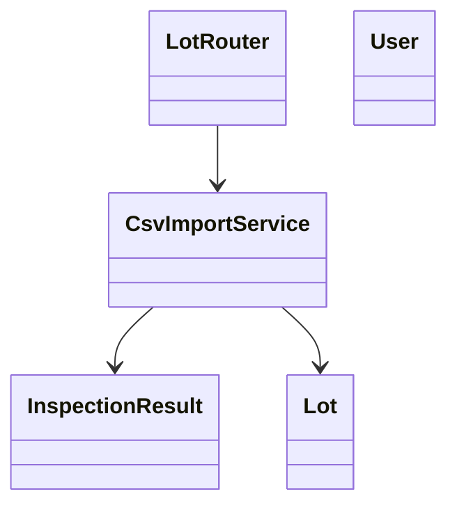

#　クラス概要

## 説明

本資料では、アプリケーションを構成する主要クラス、その役割、およびクラス間の関係を示しています。
一部の機能は現在実装中であり、最新の実装状況については README の「開発状況」を参照してください。

## クラス一覧

### デスクトップアプリ

| クラス               | 役割                                                         |
| -------------------- | ------------------------------------------------------------ |
| MainWindow           | メイン画面の表示、ユーザー操作の受付                         |
| MeasurementInfo      | メイン画面情報を保持するモデル                               |
| MeasurementResult    | 測定結果を保持するモデル                                     |
| MeasurementValidator | 測定開始前の入力内容を検証する                               |
| State                | 装置状態を表す列挙型                                         |
| StateMachine         | 現在の装置状態を保持・更新する                               |
| PlcController        | PLC との通信を模擬し、測定開始・完了などのイベントを通知する |
| RecipeDialog         | レシピ画面の表示、ユーザー操作の受付                         |
| RecipeRepository     | レシピデータの保存・更新・削除・読込                         |
| RecipeValidator      | 保存前の入力内容を検証する                                   |
| Recipe               | レシピ情報を保持するモデル                                   |
| CsvWriter            | 測定結果の CSV 出力                                          |
| ErrorType            | エラーの種類を表す列挙型                                     |
| MeasurementRecord    | 1 レコード分のデータを保持するモデル                         |
| LogLevel             | ログの重要度を表す列挙型                                     |
| LogWriter            | アプリケーションログを記録する                               |
| StatusLamp           | 装置状態を表示するカスタムウィジェット                       |

### web アプリ

| クラス           | 役割                          |
| ---------------- | ----------------------------- |
| LotRouter        | ロット情報に関する API を提供 |
| CsvImportService | CSV ファイルの取込処理        |
| InspectionResult | 測定結果を保持するモデル      |
| Lot              | ロット情報を保持するモデル    |
| User             | ユーザー情報を保持するモデル  |

## クラス図

### web アプリ

