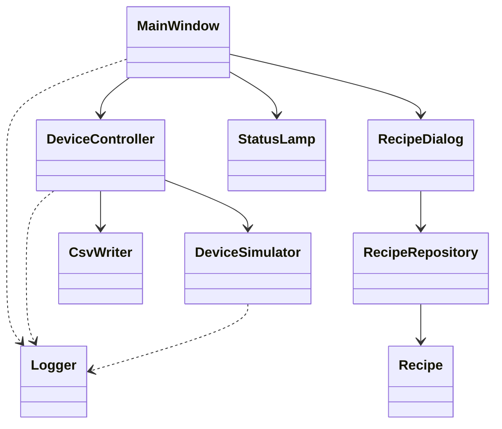
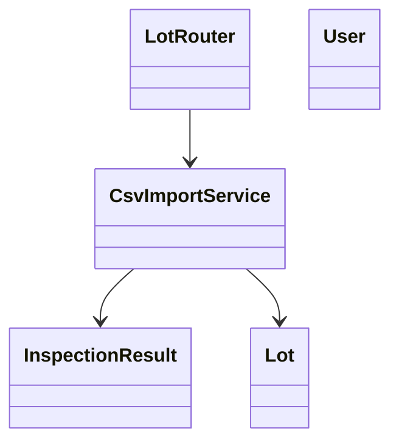

#　クラス概要

## 説明

本資料では、アプリケーションを構成する主要クラス、その役割、およびクラス間の関係を示しています。
一部の機能は現在実装中であり、最新の実装状況については README の「開発状況」を参照してください。

## クラス一覧

### デスクトップアプリ

| クラス           | 役割                                   |
| ---------------- | -------------------------------------- |
| MainWindow       | メイン画面の表示、ユーザー操作の受付   |
| DeviceController | 画面と測定シミュレーション処理を仲介   |
| DeviceSimulator  | 測定シミュレーションの実行             |
| RecipeDialog     | レシピ画面の表示、ユーザー操作の受付   |
| RecipeRepository | レシピデータの保存・更新・削除・読込   |
| Recipe           | レシピ情報を保持するモデル             |
| CsvWriter        | 測定結果の CSV 出力                    |
| Logger           | ログの記録                             |
| StatusLamp       | 装置状態を表示するカスタムウィジェット |

### web アプリ

| クラス           | 役割                          |
| ---------------- | ----------------------------- |
| LotRouter        | ロット情報に関する API を提供 |
| CsvImportService | CSV ファイルの取込処理        |
| InspectionResult | 測定結果を保持するモデル      |
| Lot              | ロット情報を保持するモデル    |
| User             | ユーザー情報を保持するモデル  |

## クラス図

### デスクトップアプリ

### web アプリ

