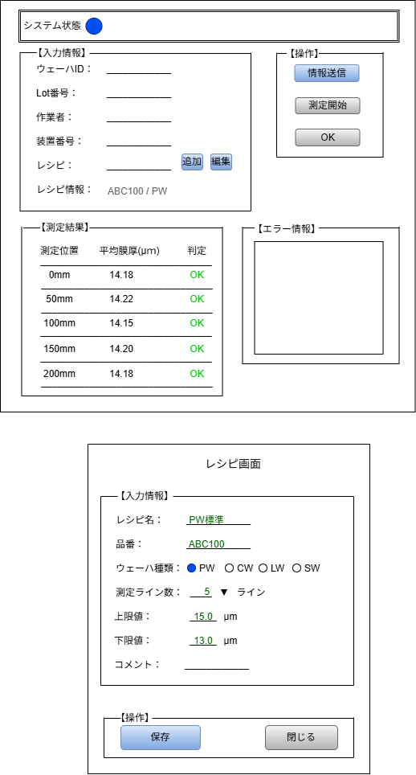

#　画面設計

## 説明

本資料では、デスクトップアプリの画面設計を示しています。
一部の機能は現在実装中であり、最新の実装状況については README の「開発状況」を参照してください。

## 画面設計

### デスクトップアプリ

メイン画面
→ レシピの選択、測定シミュレーションの実行、測定結果の表示を行う画面です。

レシピ画面
→ レシピの新規登録、編集、削除を行う画面です。

